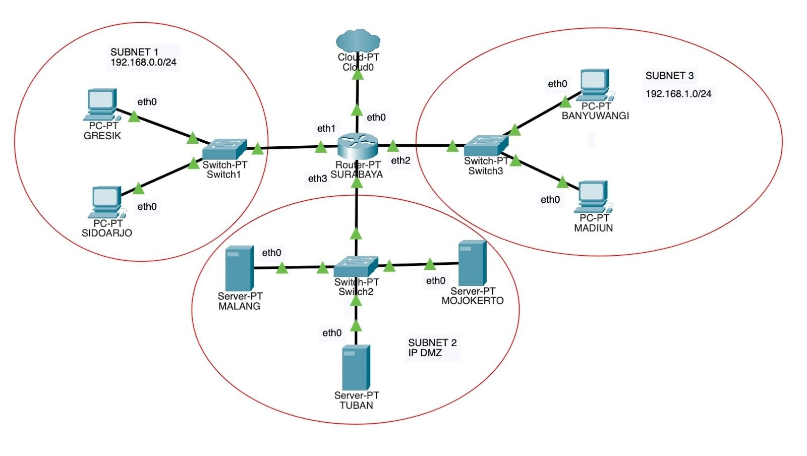
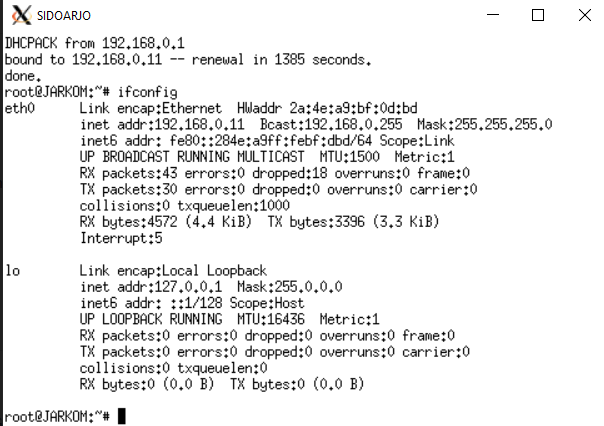
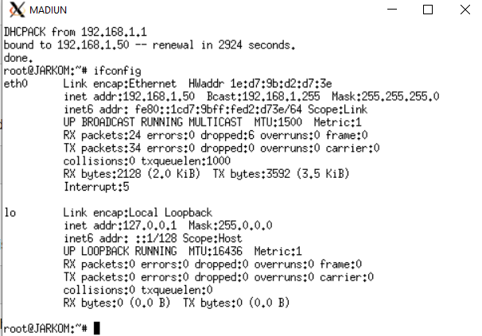
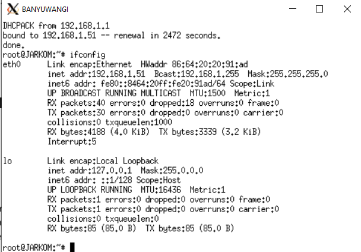
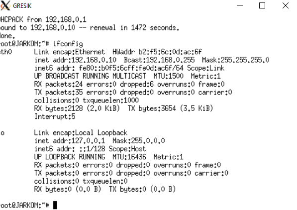
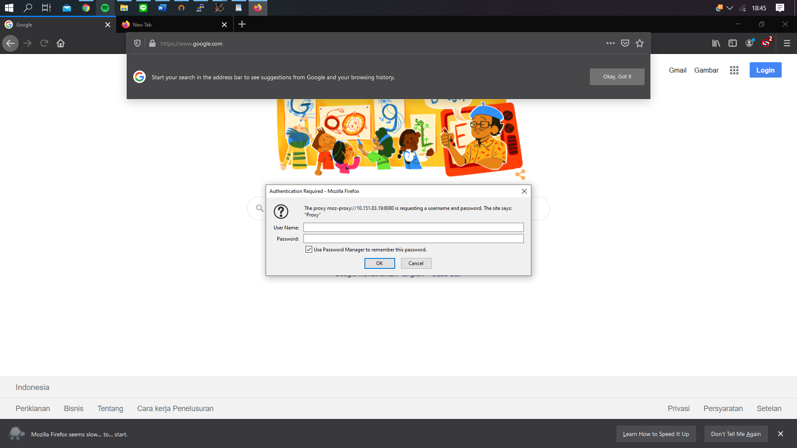
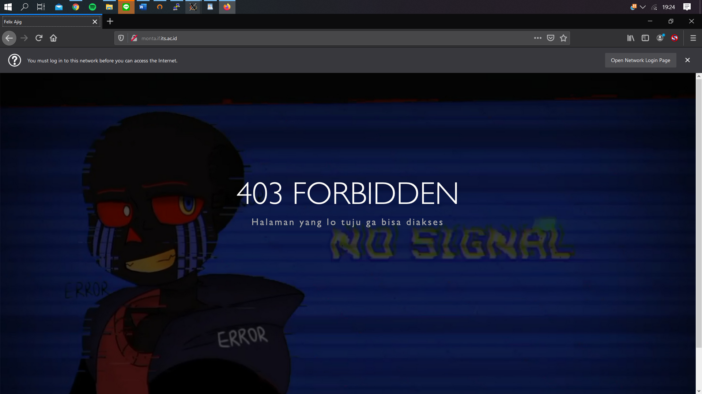
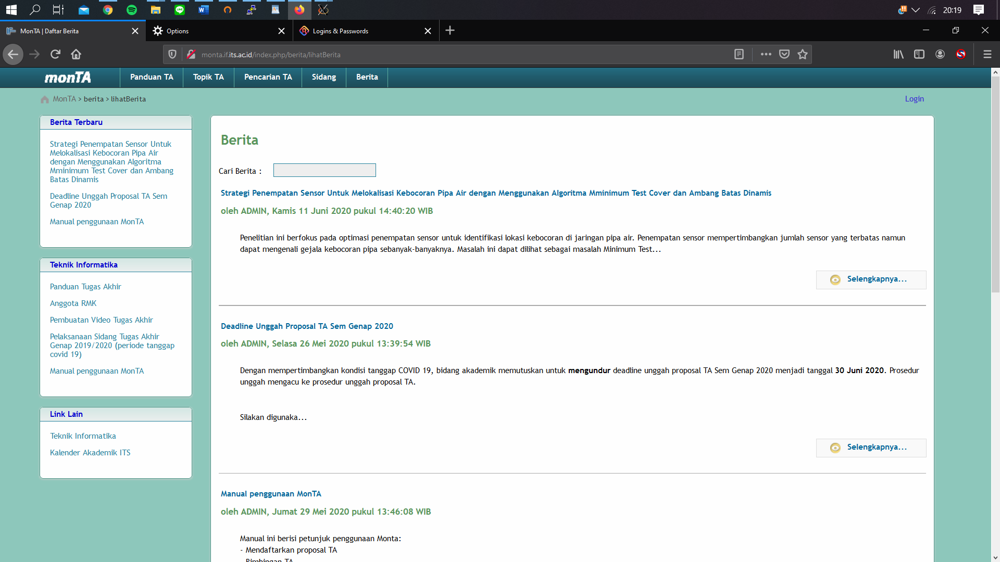
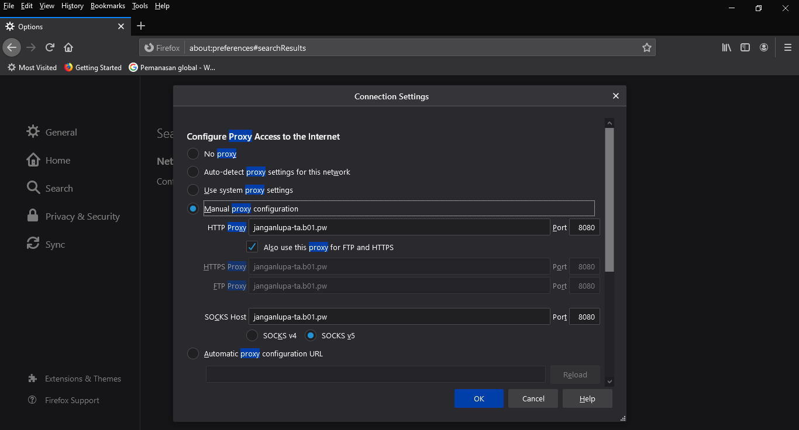
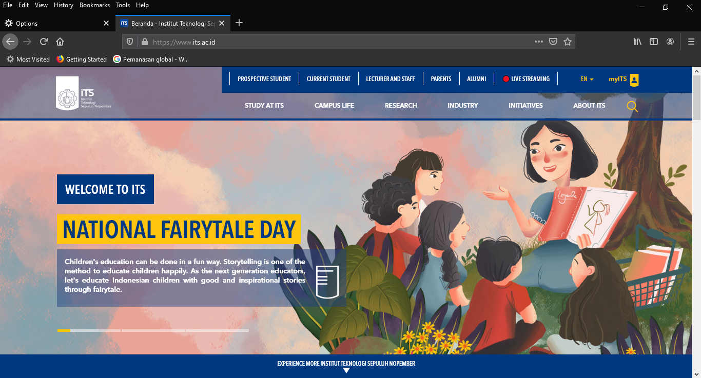

# Jarkom_Modul3_B01
 
1. Membuat topologi jaringan dengan kriteria sebagai berikut:
 

 
SURABAYA sebagai router, MALANG sebagai DNS Server, TUBAN sebagai DHCP server, serta MOJOKERTO sebagai Proxy server, dan UML lainnya sebagai client. 
 
```
# Switch
uml_switch -unix switch1 > /dev/null < /dev/null &
uml_switch -unix switch2 > /dev/null < /dev/null &
uml_switch -unix switch3 > /dev/null < /dev/null &

# Router
xterm -T SURABAYA -e linux ubd0=SURABAYA,jarkom umid=SURABAYA eth0=tuntap,,,10.$

# Server
xterm -T MALANG -e linux ubd0=MALANG,jarkom umid=MALANG eth0=daemon,,,switch2 m$
xterm -T MOJOKERTO -e linux ubd0=MOJOKERTO,jarkom umid=MOJOKERTO eth0=daemon,,,$
xterm -T TUBAN -e linux ubd0=TUBAN,jarkom umid=TUBAN eth0=daemon,,,switch2 mem=$

# Klien
xterm -T SIDOARJO -e linux ubd0=SIDOARJO,jarkom umid=SIDOARJO eth0=daemon,,,swi$
xterm -T GRESIK -e linux ubd0=GRESIK,jarkom umid=GRESIK eth0=daemon,,,switch1 m$
xterm -T BANYUWANGI -e linux ubd0=BANYUWANGI,jarkom umid=BANYUWANGI eth0=daemon$
xterm -T MADIUN -e linux ubd0=MADIUN,jarkom umid=MADIUN eth0=daemon,,,switch3 m$
```
 
2. SURABAYA ditunjuk sebagai perantara (DHCP Relay) antara DHCP Server dan client.

Kelompok kami tidak membuat setup DHCP Server pada TUBAN (dengan relay pada SURABAYA), namun membuat setup DHCP pada SURABAYA (tanpa DHCP Relay). 

```apt-get install isc-dhcp-server``` di SURABAYA

```nano /etc/default/isc-dhcp-server```

tambahkan di isc-dhcp-server

```
INTERFACESv4="eth1 eth2"
INTERFACESv6=""
```

3. Client pada subnet 1 mendapatkan range 192.168.0.10 sampai 192.168.0.100 dan 192.168.0.110 , 5. mendapatkan DNS Malang dan DNS 202.46.129.2 dari DHCP, dan 6. peminjaman alamat IP selama 5 menit

```nano /etc/dhcp/dhcpd.conf```

```
subnet 192.168.0.0 netmask 255.255.255.0 {
   range 192.168.0.10 192.168.0.100;
   range 192.168.0.110 192.168.0.200;
   option routers 192.168.0.1;
   option broadcast-address 192.168.0.255;
   option domain-name-servers 202.46.129.2, 10.151.83.18;
   default-lease-time 300;
   max-lease-time 7200;
}
```

4. Client pada subnet 2 mendapatkan range IP 192.168.0.50 sampai 192.168.1.70 , 5. mendapatkan DNS Malang dan DNS 202.46.129.2 dari DHCP, dan 6. peminjamaman alamat IP selama 10 menit

```nano /etc/dhcp/dhcpd.conf```

```
subnet 192.168.1.0 netmask 255.255.255.0 {
   	range 192.168.1.50 192.168.1.70;
    	option routers 192.168.1.1;
    	option broadcast-address 192.168.1.255;
    	option domain-name-servers 202.46.129.2, 10.151.83.18;
    	default-lease-time 600;
    	max-lease-time 7200;
}
```










7. User autentikasi

di Mojokerto

```apt-get install squid```

```mv /etc/squid/squid.conf /etc/squid/squid.conf.bak```

```apt-get install apache2-utils```

```httpasswd -c /etc/squid/passwd userta_b01``` kemudian isikan password ```inipassw0rdta_b01```

```nano /etc/squid/squid.conf```

isi squid.conf seperti ini

```
acl all src 0.0.0.0/0.0.0.0

http_port 8080
visible_hostname mojokerto

auth_param basic program /usr/lib/squid/ncsa_auth /etc/squid/passwd
auth_param basic children 5
auth_param basic realm Proxy
auth_param basic credentialsttl 2 hours
auth_param basic casesensitive on
acl USERS proxy_auth REQUIRED
```

```service squid restart```



8. penggunaan internet Anri dibatasi menjadi Selasa - Rabu pukul 13.00-18.00 dan 9. Selasa - Kamis pukul 21.00-09.00

```nano /etc/squid/acl.conf```

```
acl AVAILABLE_WORKING time TW 13:00-18:00
acl AVAILABLE_WORKING2 time TWH 21:00-23:59
acl AVAILABLE_WORKING3 time WHF 00:00-09:00
```

```nano /etc/squid/squid.conf```

tambahkan di squid.conf

```
include /etc/squid/acl.conf

http_access allow USERS AVAILABLE_WORKING
http_access allow USERS AVAILABLE_WORKING2
http_access allow USERS AVAILABLE_WORKING3
```

```service squid restart```



10. pada saat Anri mengakses google.com, maka akan redirect ke monta.if.its.ac.id

```nano /etc/squid/squid.conf```

tambahkan di squid.conf

```
acl REDIRECT dstdomain .google.com
deny_info http://monta.if.its.ac.id/ REDIRECT
http_access deny REDIRECT
```

```service squid restart```



11. Anri diminta mengganti error page default squid

```cd /usr/share/squid/errors/English```

```rm ERR_ACCESS_DENIED```

```wget 10.151.36.202/ERR_ACCESS_DENIED```

```nano /etc/squid/squid.conf```

tambahkan di squid.conf

```
error_directory /usr/share/squid/errors/English/
```

```service squid restart```


 
12. Ketika menggunakan proxy cukup dengan mengetikkan domain janganlupa-ta.yyy.pw dan memasukkan port 8080. 
 
di MALANG

inatall bind9 ```apt-get install bind9 -y```

```nano /etc/bind/named.conf.local```

tambahkan di named.conf.local

```
zone "janganlupa-ta.b01.pw" {
        type master;
        file "/etc/bind/jarkom/janganlupa-ta.b01.pw";
}; 
``` 

```mkdir /etc/bind/jarkom```

```cp /etc/bind/db.local /etc/bind/jarkom/janganlupa-ta.b01.pw```

```nano /etc/bind/jarkom/janganlupa-ta.b01.pw```

isinya seperti ini

```
$TTL    604800
@       IN      SOA     janganlupa-ta.b01.pw. root.janganlupa-ta.b01.pw. (
                        2020112501      ; Serial
                         604800         ; Refresh
                          86400         ; Retry
                        2419200         ; Expire
                         604800 )       ; Negative Cache TTL
;
@       IN      NS      janganlupa-ta.b01.pw.
@       IN      A       10.151.83.19
```

```service bind9 restart```

Atur proxy manual di firefox mengetikkan domain janganlupa-ta.b01.pw dan memasukkan port 8080
 

 
Masukkan kembali username dan password
 

 
Berhasil browsing
 

